1.创建环境

conda create -n my_new_env python=3.11  

conda activate my_new_env

cd /mnt/d/sql-edu-main/sql-edu-backend

pip install -r requirements.txt

conda install -c conda-forge nodejs

2.建库

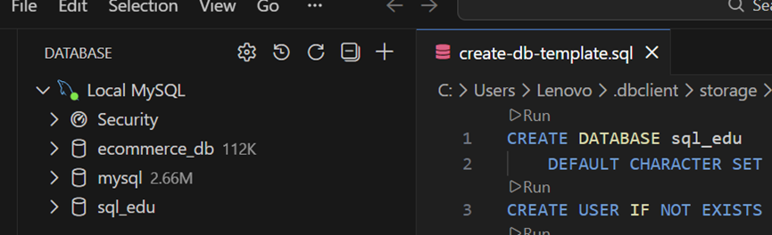

3.填入相关信息

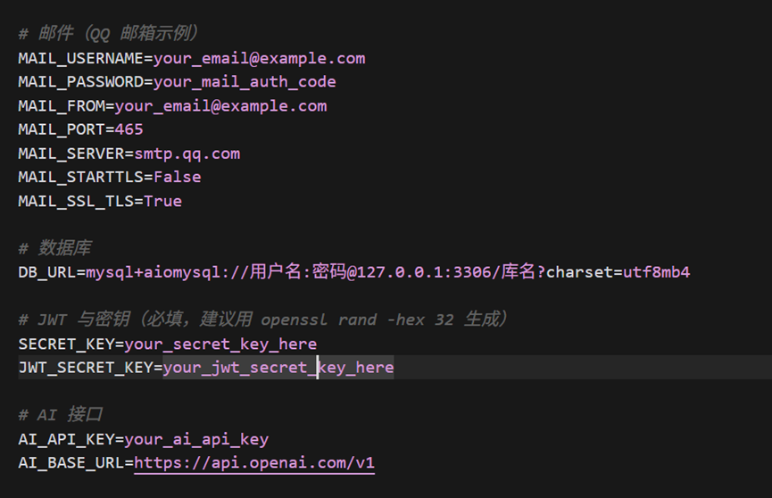

4.启动后端

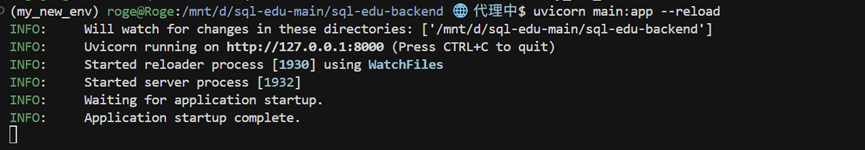

5.安装前端的依赖包npm install --registry=https://registry.npmmirror.com --loglevel=error

6.启动前端

npm run dev:h5

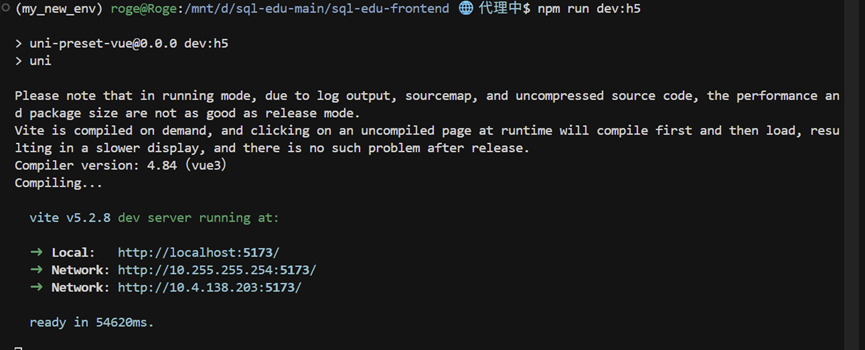

7.测试各项功能：

一、教师端：

\1.   注册：（输入邀请码ILOVESQL为教师）

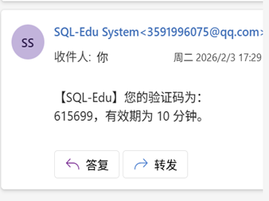

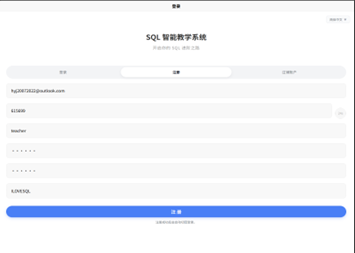

2.登录：

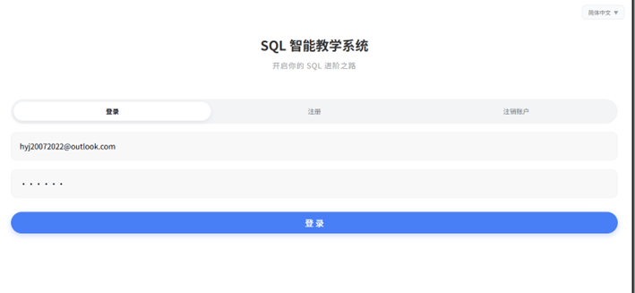

3.点击题目管理进入教师端：

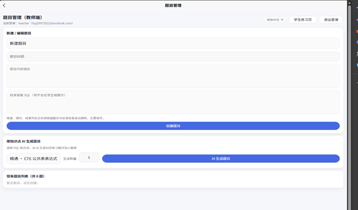

AI生成题目(可人为修改)：

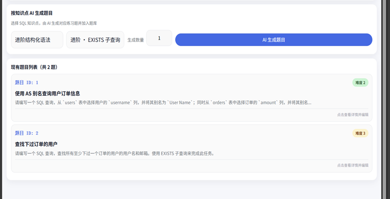

人为创建题目：

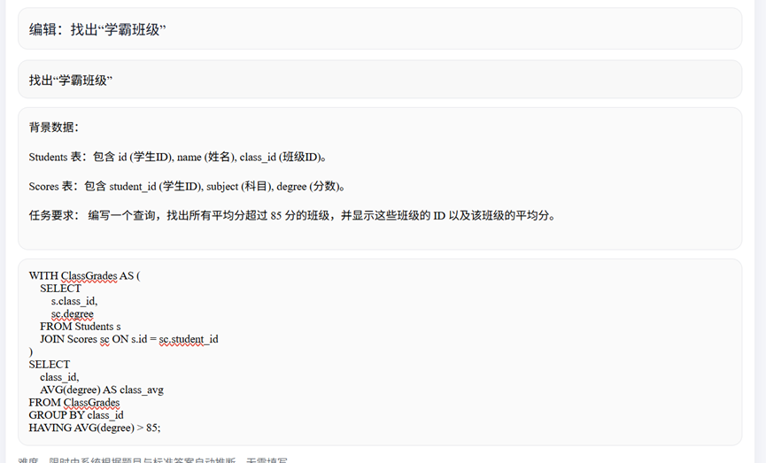

二、学生端：

1.选题：

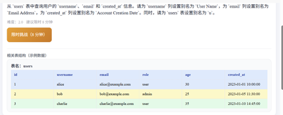

2.提交、对话

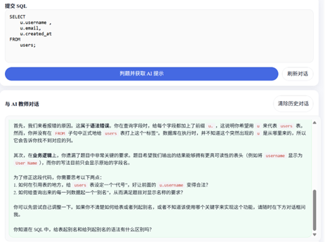

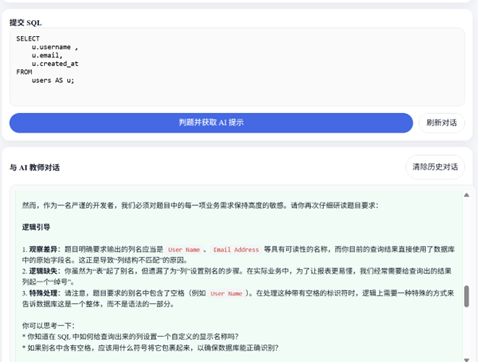

3.反馈

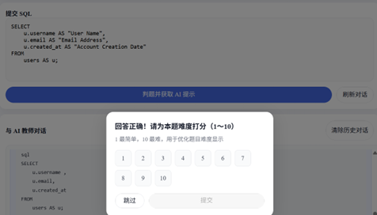