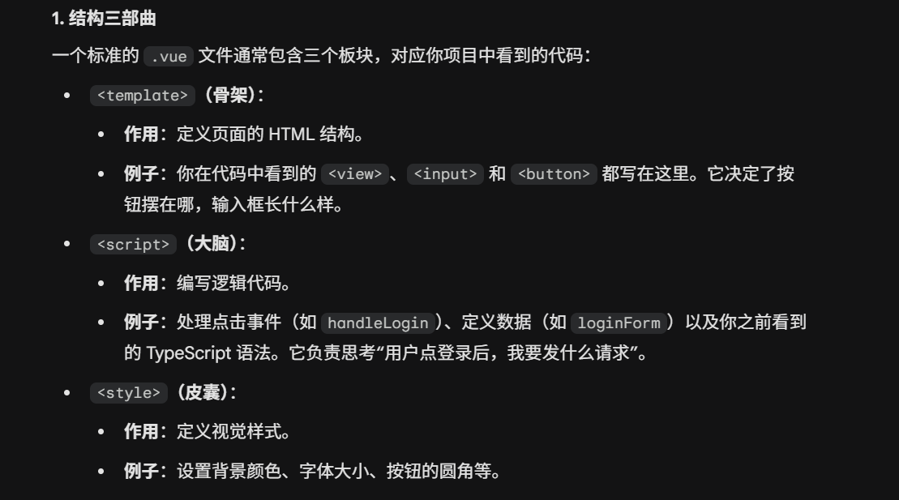
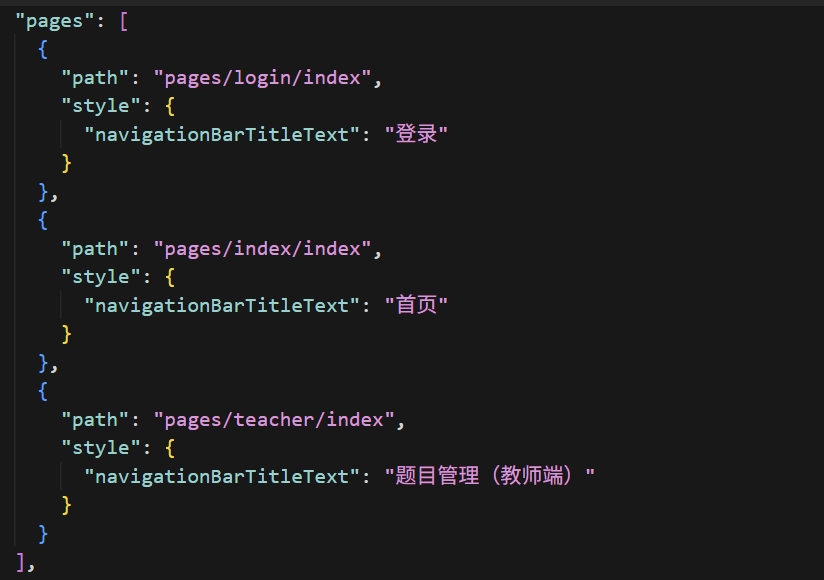
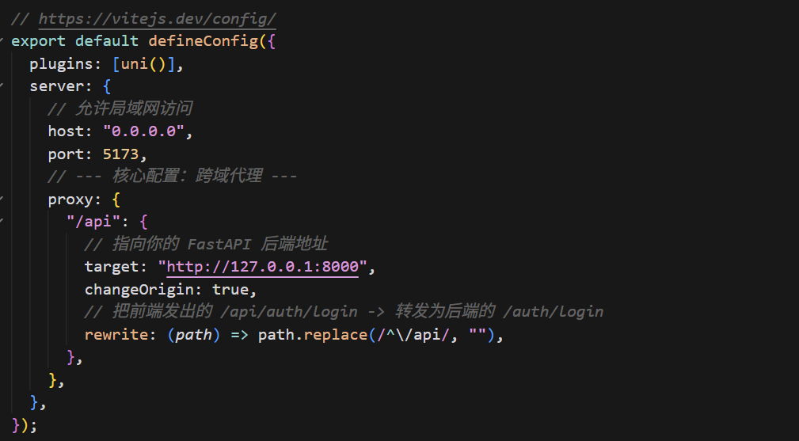
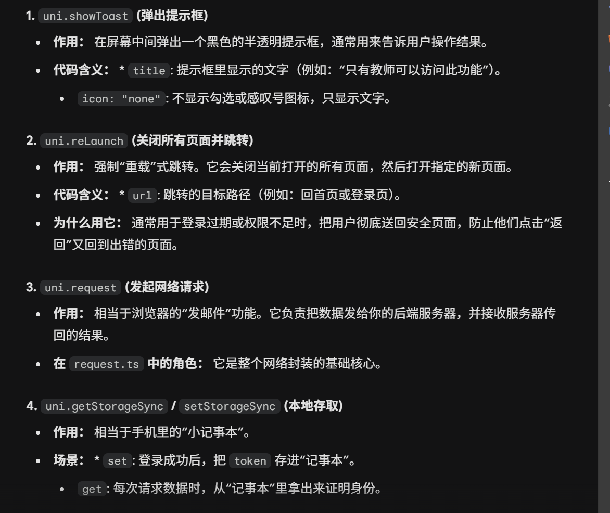
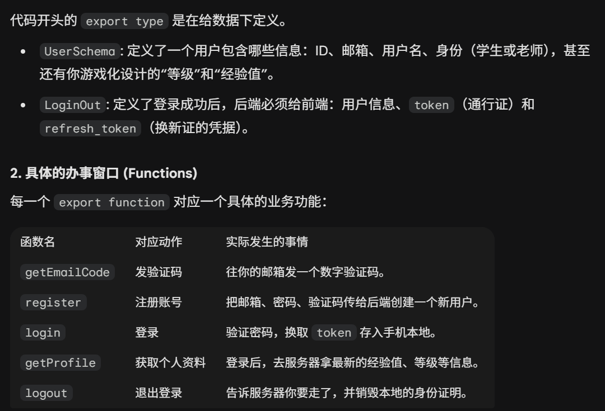
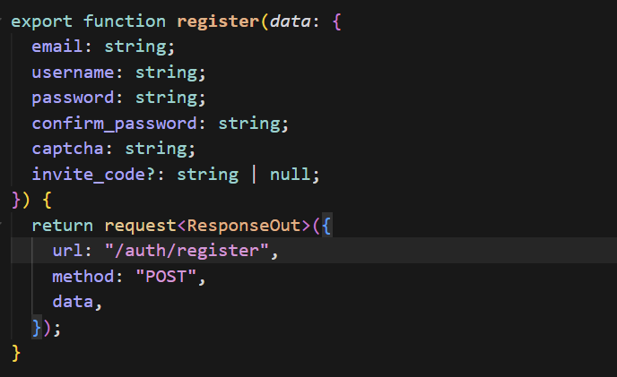
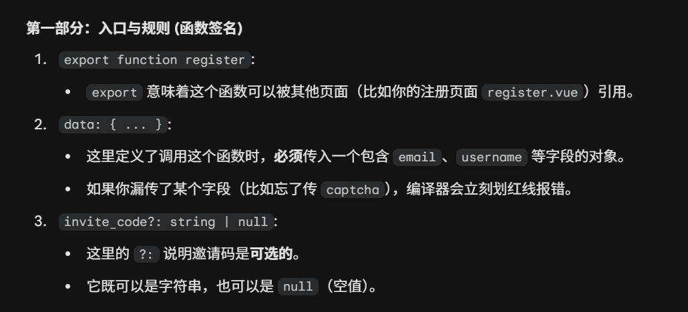

# 前端实现步骤：对照 sql-edu-new 看 sql-edu-frontend 做了什么

本文以 **sql-edu-new**（新建的 uni-preset-vue 脚手架）为起点，按**逻辑顺序**对照 **sql-edu-frontend**，说明在前端都做了哪些事、怎么做的，方便一步一步跟着看。

.json 文件：项目的“身份证”与“配置清单”

`.ts` 文件：项目的“逻辑大脑”

`.vue`文件是 uni-app/Vue 框架的“多功能建筑蓝图”，在传统的网页开发中，你可能需要分别管理一个 HTML 文件（骨架）、一个 CSS 文件（皮肤）和一个 JS 文件（大脑）。而 .vue 文件通过 SFC（单文件组件） 模式，把这三者打包在一起，形成一个可以重复使用的“功能模块”。

---

## 一、起点：sql-edu-new 里有什么

- **package.json**：uni-app + Vue3 + TypeScript，脚本 `dev:h5`、`build:h5` 等。
- **src/main.ts**：`createSSRApp(App)` 入口。
- **src/App.vue**：仅 `onLaunch/onShow/onHide` 打日志。
- **src/pages.json**：只有一个页面 `pages/index/index`，标题 "uni-app"。
- **src/pages/index/index.vue**：静态页，一个 logo + "Hello" 文案。
- **vite.config.ts**：仅 `plugins: [uni()]`，无代理。

也就是说：**一个空壳 + 一个占位首页**，没有接口、没有登录、没有路由规划。

---

## 二、逻辑顺序：从前到后做了哪些事

下面按「先搭骨架 → 再接后端 → 再做页面」的顺序写。

---

### 第 1 步：路由与页面规划（pages.json）

**目的**：定好「有哪些页面、谁先出现」。

- **sql-edu-new**：只有 `pages/index/index`，且是启动页。
- **sql-edu-frontend**：
  - 把**登录页**放在第一项，作为启动页：`pages/login/index`（标题「登录」）。
  - 第二页：`pages/index/index`（学生练习，标题「首页」）。
  - 第三页：`pages/teacher/index`（教师端，标题「题目管理（教师端）」）。

**怎么做**：在 `pages.json` 的 `pages` 数组里按顺序写三条，第一项即启动页。未登录时由前端逻辑跳转到登录页（见第 4 步）。

---

### 第 2 步：开发环境代理（vite.config.ts）

**目的**：本地跑 H5 时，前端请求 `/api/xxx` 能转发到后端，避免跨域。

- **sql-edu-new**：无 proxy。
- **sql-edu-frontend**：
  - `server.proxy["/api"]`：`target: "http://127.0.0.1:8000"`，`rewrite: path => path.replace(/^\/api/, "")`。
  - 效果：浏览器里请求 `http://localhost:5173/api/auth/login` → 被转发为 `http://127.0.0.1:8000/auth/login`。

**怎么做**：在 `vite.config.ts` 的 `server` 里加上上述 `proxy` 配置；前端所有请求统一用「基础路径 + 路径」（见第 3 步的 BASE_URL）。

---

### 第 3 步：网络请求封装（utils/request.ts）

**目的**：统一 baseURL、自动带 Token、401 时尝试 refresh 或跳转登录。

- **sql-edu-new**：无请求封装。
- **sql-edu-frontend**：新增 `src/utils/request.ts`。
  - **BASE_URL**：开发环境用 `/api`（走代理），生产环境用线上域名。
  - **请求头**：从 `uni.getStorageSync('token')` 取 token，若有则加 `Authorization: Bearer <token>`。
  - **响应处理**：
    - 2xx：`resolve(res.data)`。
    - 401 或「403 且 detail 像认证错误」：若未重试过且非登录/注册/验证码/refresh 接口，则先调 `POST /auth/refresh` 拿新 token，再重试一次原请求；若 refresh 失败或没有 refresh_token，则清空本地 token/refresh_token/user、`uni.reLaunch` 到登录页。
    - 其他错误：`reject` 并可选 `uni.showToast`。
  - **失败**：网络错误时 toast「网络连不上后端」。

**怎么做**：封装一个 `request<T>(options)`，内部用 `uni.request`，在 `success` 里按 statusCode 分支；登录/注册等接口把 token 存到 `uni.setStorageSync('token'/'refresh_token'/'user')`，供这里读取。

---

### 第 4 步：认证工具（utils/auth.ts）

**目的**：判断是否登录、是否教师，以及「未登录/非教师」时跳转。

- **sql-edu-new**：无。
- **sql-edu-frontend**：新增 `src/utils/auth.ts`。
  - `ensureAuthed()`：无 token 则 `uni.reLaunch` 到 `/pages/login/index`，返回 false；否则返回 true。
  - `isTeacher(profile)`：`profile?.role === 'teacher'`。
  - `requireTeacher(profile)`：非教师则 toast「只有教师可以访问此功能」并 `reLaunch` 到学生首页，返回 false。

**怎么做**：在学生首页、教师页的 `onShow`/`onMounted` 里先 `getProfile()`，再根据是否需要登录/教师调用 `ensureAuthed()` 或 `requireTeacher(profile)`，不通过就不继续拉数据。

uni. 理解为 “统一调用指令”：

---

### 第 5 步：认证 API（api/auth.ts）

**目的**：把后端认证相关接口封装成前端函数，供登录页、个人中心等调用。

- **sql-edu-new**：无。
- **sql-edu-frontend**：新增 `src/api/auth.ts`，内部全部用 `request()`。
  - 类型：`ResponseOut`、`UserSchema`（含 id、email、username、role、level、experience_in_level、xp_to_next_level）、`LoginOut`（user、token、refresh_token）。
  - 接口：`getEmailCode`、`register`、`login`、`refreshToken`、`logout`、`getProfile`、`updateProfile`、`changePassword`、`deleteAccount`。

**怎么做**：每个接口对应一个函数，`url` 与后端路由一致（如 `/auth/login`），方法、入参、返回类型与后端约定一致；登录成功后把返回的 token、refresh_token、user 存到 storage（一般在登录页里存）。

Eg :

### 第 6 步：题目 API（api/questions.ts）

**目的**：题目列表/详情、创建/更新/删除、知识点、AI 生成题目、多语言补全、难度反馈等。

- **sql-edu-new**：无。
- **sql-edu-frontend**：新增 `src/api/questions.ts`。
  - 类型：`QuestionOut`（含多语言字段、schema_preview、required_output_columns、display_difficulty、suggested_time_seconds 等）、`KnowledgePoint`（含 name_i18n 等）。
  - 接口：`getQuestions`、`getQuestion`、`createQuestion`、`updateQuestion`、`deleteQuestion`、`submitDifficultyFeedback`、`getKnowledgePoints`、`generateSchemaPreview`、`generateQuestionI18n`、`generateQuestionsByAI`。

**怎么做**：同样用 `request()`，URL 与后端一致（如 `/questions/` 带尾斜杠避免 307 导致 Authorization 丢失）；教师端页面只调用需要权限的接口（创建/更新/删除/AI 生成等）。

---

### 第 7 步：AI/判题与对话 API（api/ai.ts）

**目的**：SQL 判题、提交记录、与 AI 对话。

- **sql-edu-new**：无。
- **sql-edu-frontend**：新增 `src/api/ai.ts`。
  - 类型：`SqlHintResponse`、`SqlCheckResponse`（is_correct、hint、submission_id、earned_experience、level_up、new_level）、`SubmissionOut`、`ChatMessage`。
  - 接口：`checkSql`（判题）、`getMySubmissions`、`getSubmission`、`getChatMessages`、`clearChatMessages`、`chatWithTeacher`。

**怎么做**：学生页「提交 SQL」调 `checkSql`，对话区域调 `getChatMessages`、`chatWithTeacher`、`clearChatMessages`；列表用 `getMySubmissions`。

---

### 第 8 步：登录页（pages/login/index.vue）

**目的**：登录、注册、注销账户；多语言切换；成功后存 token 并跳转。

- **sql-edu-new**：无登录页。
- **sql-edu-frontend**：
  - **布局**：顶部语言选择（简体中文/English/繁體中文），标题/副标题；Tab：登录 / 注册 / 注销账户；各 Tab 下对应表单。
  - **多语言**：`UI_STRINGS` 数组三套文案，`languageIndex` 与 `uni.setStorageSync('ai_language')` 同步；`onMounted` 从 storage 恢复语言并设置导航栏标题。
  - **登录**：`loginForm.email`、`loginForm.password` → `login()` → 存 token、refresh_token、user → `uni.reLaunch({ url: '/pages/index/index' })`。
  - **注册**：获取验证码 `getEmailCode`（60 秒倒计时）→ `register()`（含 invite_code 可选）→ 成功后切回登录 Tab 并预填邮箱密码。
  - **注销**：`deleteAccount`，需邮箱+密码确认。

**怎么做**：用 `ref`/`reactive` 管表单和 loading；请求用 `api/auth` 里的方法；成功后写 storage 再 `reLaunch`；语言切换时更新 `languageIndex` 和 storage，并 `setNavigationBarTitle`。

---

### 第 9 步：学生练习页（pages/index/index.vue）

**目的**：选题、看题面与表结构、写 SQL、判题、限时挑战、与 AI 对话、经验与等级展示；多语言。

- **sql-edu-new**：只有一个静态 index，无业务。
- **sql-edu-frontend**：
  - **进入**：`onShow` 里 `ensureAuthed()`，未登录则被 auth 工具重定向；再 `getProfile()`、`getQuestions()`，教师则显示「题目管理」按钮。
  - **选题**：picker 选题目 / 输入题号跳转 / 随机选题；当前题用 `currentQuestion`，多语言题面用 `localizedTitle`/`localizedContent`（按 `ai_language` 取 title_en/content_en 或 title_zh_tw/content_zh_tw，缺则用中文或「Translating...」）；若缺翻译可调 `generateQuestionI18n` 并刷新。
  - **题面展示**：`required_output_columns` 单独一块；`schema_preview` 解析成表格展示（列名 + 示例行）；难度、建议用时、限时挑战按钮（可选）。
  - **SQL 输入与判题**：textarea 绑 `studentSql`，点「判题」调 `checkSql`；提交后展示 hint、是否正确、经验与升级信息；限时挑战内完成可传 `challenge_mode: true`。
  - **对话**：`getChatMessages` 拉历史，`chatWithTeacher` 发消息，`clearChatMessages` 清空；消息列表用 `parseMarkdown` 渲染；支持按当前语言传 `language`。
  - **顶部**：当前用户、等级条（Lv.x、经验进度）、语言切换、题目管理（教师）、退出登录。

**怎么做**：大量状态（题目列表、当前题、提交中、对话列表、语言等）用 ref/reactive；多语言用统一的 `UI_STRINGS` + `ai_language`；表结构用 JSON 解析后循环列和行渲染；判题与对话都走 `api/ai`。

---

### 第 10 步：教师页（pages/teacher/index.vue）

**目的**：题目 CRUD、按知识点 AI 生成题目、多语言补全、题目列表展示；仅教师可进。

- **sql-edu-new**：无。
- **sql-edu-frontend**：
  - **进入**：`onShow` 里 `ensureAuthed()` 然后 `getProfile()`，再 `requireTeacher(profile)`，非教师则被重定向到学生首页。
  - **编辑区**：picker 选「新建题目」或已有题目；表单：title、content、correct_sql；保存时 `editingIndex === -1` 则 `createQuestion`，否则 `updateQuestion`；删除当前题 `deleteQuestion`；「补全多语言」调 `generateQuestionI18n`。
  - **AI 生成**：picker 选知识点（`getKnowledgePoints`，展示用 `name_i18n`/当前语言），输入数量，点「AI 生成题目」调 `generateQuestionsByAI`，成功后刷新题目列表。
  - **题目列表**：`getQuestions()` 拉列表，每题展示本地化标题、内容摘要、难度；点击某题填入编辑区。

**怎么做**：教师权限用 `requireTeacher`；知识点列表用 `getKnowledgePoints`，名称按当前语言取 `name_i18n` 或默认 name；所有写操作用 `api/questions` 的 create/update/delete/generate。

---

## 三、文件与目录对照小结

| 项目           | sql-edu-new        | sql-edu-frontend                                      |
|----------------|--------------------|--------------------------------------------------------|
| 入口/App       | main.ts + App.vue  | 同，无业务改动                                         |
| 路由           | pages.json 单页    | pages.json 三页：login → index → teacher              |
| 代理           | 无                 | vite.config.ts proxy /api → 8000                       |
| 工具           | 无                 | utils/request.ts、utils/auth.ts                        |
| API            | 无                 | api/auth.ts、api/questions.ts、api/ai.ts               |
| 页面           | index 占位         | login/index、index/index（学生）、teacher/index（教师）|
| 多语言         | 无                 | 各页 UI_STRINGS + ai_language storage + 导航栏标题    |

---

## 四、建议阅读顺序（按逻辑）

1. **pages.json**：看三页顺序与标题。
2. **vite.config.ts**：看 proxy 如何把 `/api` 转到后端。
3. **utils/request.ts**：看 BASE_URL、带 Token、401/refresh、跳转登录。
4. **utils/auth.ts**：看登录校验与教师校验。
5. **api/auth.ts**：看登录/注册/profile 等接口形状。
6. **api/questions.ts**、**api/ai.ts**：看题目与判题、对话接口。
7. **pages/login/index.vue**：看登录/注册/注销流程与多语言。
8. **pages/index/index.vue**：看学生选题、判题、对话、多语言题面与表结构。
9. **pages/teacher/index.vue**：看教师校验、题目 CRUD、AI 生成与多语言补全。

这样从「新建的 sql-edu-new」出发，按上述顺序对照「sql-edu-frontend」的改动，就能一步步理清前端都做了什么、怎么做的。