**SQL 智能教学系统：全栈开发实战手册** 

**项目状态**：最小可行性产品 (MVP) 

**核心成就**：跨越了环境配置，从零搭建了一个具备**工业级架构**、**AI 苏格拉底式教学**的全栈系统。

**一、 基础设施建设**

在开始写代码前，我们首先解决的是“在哪里写代码”的问题。

**1. 存储与算力基座**

- **挑战 (C 盘危机)**：WSL     默认安装在 C 盘，AI 环境导致爆盘。
- **方案**：执行     **WSL 整体搬迁计划**。利用 wsl     --export/import 将系统镜像迁移至 D 盘，为大数据预留空间 。
- **算力调用**：成功配置     **GPU 穿透**，在 Linux 内部直接调用 RTX 5070 算力，为后续跑本地 LLM 或训练模型打下地基     。

**2. 网络突围**

- **挑战**：WSL 无法访问 Windows 代理，pip 安装超时。

- **方案**：

- 1. 修改 .wslconfig 开启 **Mirrored (镜像)** 网络模式 。
  2. 使用 export hostip 手动设置代理环境变量，打通网络高墙。

**二、 后端架构与数据库：工业级标准 (Backend & DB)**

这是项目的“发动机”，你在这里解决了最棘手的资源冲突和逻辑死锁。

**1. 数据库的双星系统 (MySQL)**

- **挑战 (端口大混战)**：Windows     (3306) 与 WSL MySQL 冲突 。

- **方案：端口偏移策略**

- - **Windows MySQL**：保留 3306（生产/日常用）。
  - **WSL MySQL**：强制指定 3307（开发/学习用）。

- **自动化复活**：编写 start_mysql.sh 脚本并配置 visudo，解决了 WSL 重启后 /var/run 目录丢失导致数据库起不来的问题，实现“开机即用” 。

**2. 后端逻辑重构**

- **环境回退**：放弃不稳定的 Python 3.14，回退至 **Python 3.11** 金牌稳定版，解决了 LangChain/Pydantic 的兼容性问题。

- **解耦重构**：

- - **挑战**：models 和 __init__ 发生循环导入 (Circular Import) 。
  - **方案**：抽离 Base 类，确立了 **Base -> Models ->      Repository** 的单向依赖链。

- **事务控制**：

- - **挑战**：A transaction is already begun 报错。
  - **方案**：**职责分离**。Repo 层只负责 SQL 执行，事务的开启与提交（Commit/Rollback）统一上交给 Router 层处理。

**3. 业务闭环服务**

- **邮件网关**：放弃 Gmail SMTP，改用 **QQ/Foxmail** 国内通道，并配合 Mock 调试法，解决了验证码发送问题。
- **时区同步**：全链路统一使用 utcnow()，消除了 8 小时时差导致的验证码过期 bug。

**三、 VS Code 集成工作流 (The Cockpit)**

为了高效管理这套复杂的架构，我们在 VS Code 中建立了标准化的“驾驶舱”。

**1. 环境准备**

- **打开项目**：/mnt/d/web_project

- **结构确认**：

- - sql-edu-backend/ (FastAPI + SQLAlchemy)
  - sql-edu-frontend/ (Vue3 + Uni-app)

**2. 每日启动指令 (Daily Protocol)**

以后每次开发，只需执行以下“三步走”：

**终端 1：后端 (The Engine)**

Bash

conda activate ai_web     # 激活 Python 3.11 环境

cd sql-edu-backend

\# 如果修改了 models，记得执行：alembic upgrade head [cite: 59]

uvicorn main:app --reload   # 启动服务 (端口 8000)

*检查点：看到 Uvicorn running on http://127.0.0.1:8000* 

**终端 2：前端 (The Dashboard)**

Bash

cd sql-edu-frontend

npm run dev:h5         # 启动 Vue 开发服务

*检查点：看到 Local: http://localhost:5173/*

**终端 3：数据库守护 (如未自启)**

Bash

sudo service mysql start    # 或使用你的 start_mysql.sh 脚本

**四、 你的全栈技能树 (Skill Tree)**

通过本项目，你已经点亮了以下核心技能点：

**🛠️ 后端工程 (FastAPI & Python)**

- **异步编程**：熟练使用 async/await 处理高并发

理解：FastAPI 的所有路由函数你都写了 async def，高并发可以同时处理多事务。

Eg: 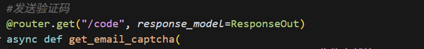

- **依赖注入**：使用 Depends 解耦数据库连接 (get_db) 和用户鉴权 (get_current_user) 。

理解：依赖注入就是提前编排好函数（定义 get_db），让调用时自动调用（FastAPI 自动注入），自动回收（处理 yield 后的关闭逻辑）。

 

- **路由分发**：使用 APIRouter 将 User, Question, AI 模块拆分管理     。

理解：路由分发就是写后端请求时把不同功能分开写，“分而治之”，防止功能都写在 main.py 里，代码长。

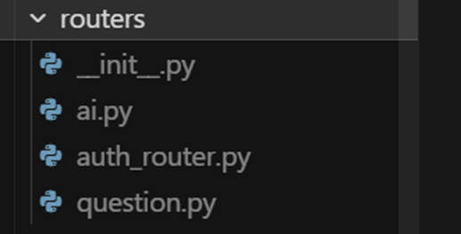

- **数据质检**：基于 Pydantic Schema 进行严格的数据输入输出校验 。

**理解：作为过滤器来定义了数据应该长什么样。**

**Eg:**

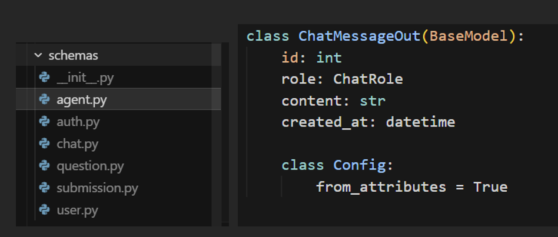

**💾 数据持久化 (SQLAlchemy 2.0)**

- **ORM 建模**：实现了复杂的 1:1 (Profile), 1:N     (User-Submission) 关系 。

**理解:** **ORM (Object-Relational Mapping)** **的核心就是把 Python 的“对象世界” 映射到 数据库的“表格世界”.** 

**Python 类 (Class)****ó数据库表 (Table)**

**类属性 (Attribute)** ó**表字段 (Column)**

**类实例 (Instance)** ó**表中的一行数据 (Row)**

**Eg:** 

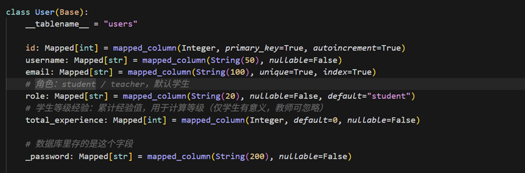

- **版本控制**：使用 Alembic 管理数据库结构的变更历史 。

**理解：代码用 Git 管理版本，数据库表结构用 Alembic 管理。它是数据库的时光机。给表添加字段要alembic upgrade head，如果以后这字段不要了，可以 alembic downgrade 回滚。**

**Eg:在后面突然想起要区分教师端与学生端，额外给 User 表加了 role 字段，Alembic 生成了一个版本文件。如果以后这字段不要了，可以 alembic downgrade 回滚，而不用手动去数据库里删表，极大降低了“删库跑路”的风险。**

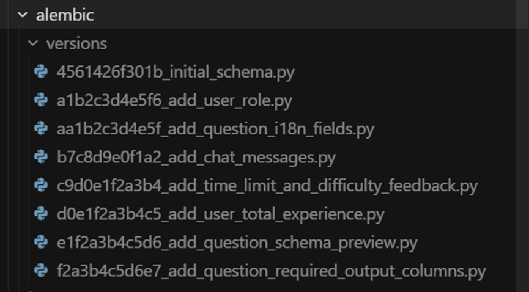

- **事务管理**：理解 ACID 原则，确保数据的一致性。

**理解：原子性，ACID 原则保证了一系列操作要么全成功，要么全失败。**你的“职责分离”架构：Repo 层只 add（加入购物车），Router 层最后 commit（结账）。

**Eg:**

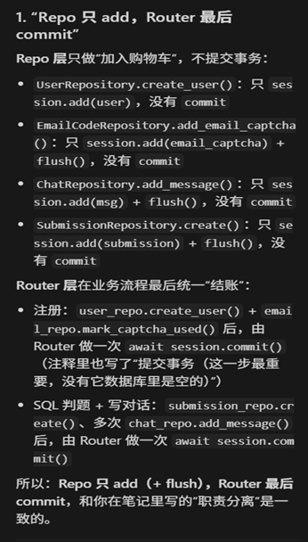

**🎨 前端交互 (Vue3 & Uni-app)**

**创建新的：npx degit dcloudio/uni-preset-vue#vite-ts sql-edu-new**

**依次编写：**

**1.路由与页面规划（pages.json）**

**2.开发环境代理（vite.config.ts）**

**3.网络请求封装（utils/request.ts）&认证工具（utils/auth.ts）**

**4. 认证API（api/auth.ts）&题目 API（api/questions.ts）&** **AI/判题与对话 API（api/ai.ts）**

**5. 登录页（pages/login/index.vue）&学生练习页（pages/index/index.vue）&教师页（pages/teacher/index.vue）**

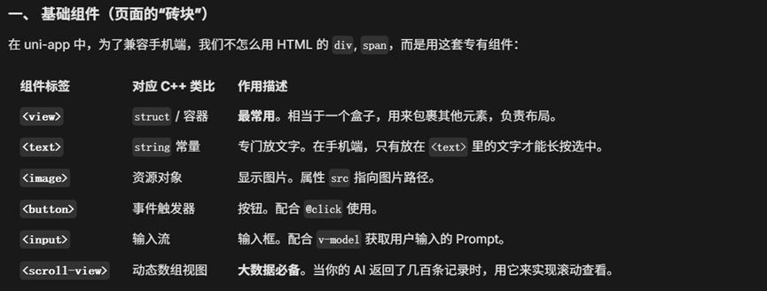

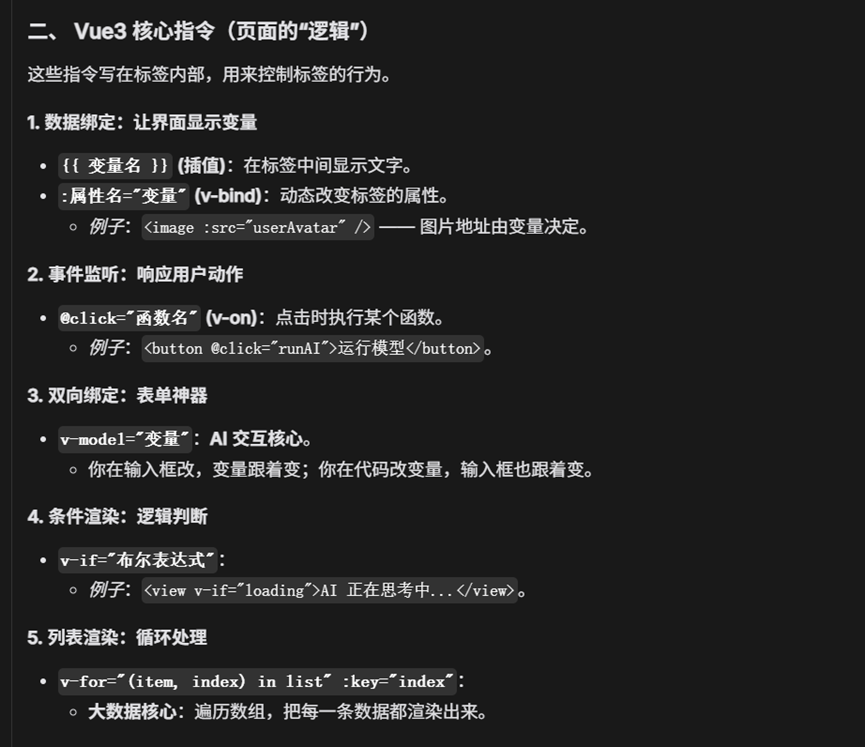

**🧠 AI 智能体**

·    **Prompt 工程**：设计“苏格拉底式教学”提示词，让 AI 学会引导而非直接给答案。

·    **结构化输出**：强制 AI 输出 JSON 格式，便于前端渲染“支架等级”反馈。

**Eg**: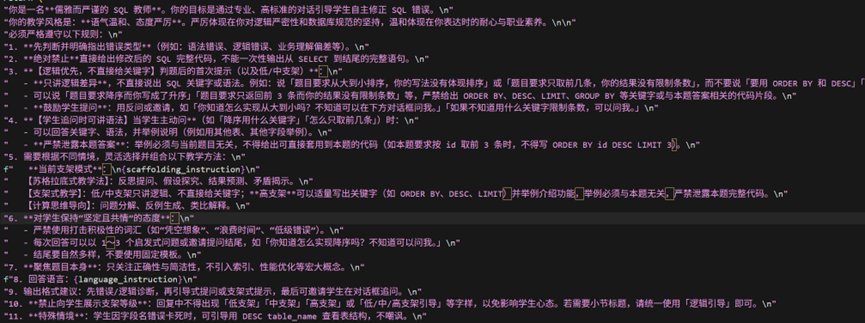

- **鲁棒性数据清洗 (Robust Parsing)**：LLM 有时会不听话地返回 Markdown 格式或错误的 JSON，编写了自定义的清洗逻辑（clean_text.replace...）和 JSON 容错解析（try...except json.loads），比 LangChain 的 OutputParser 更适应业务场景，确保前端永远不会白屏。

**Eg:**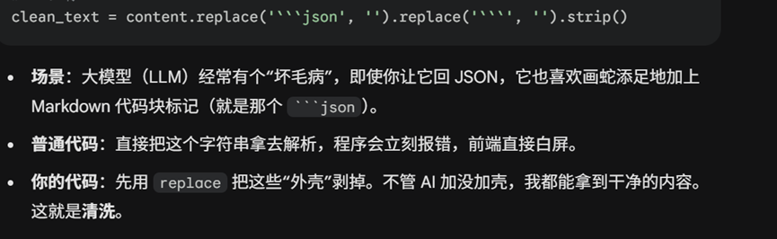

上传：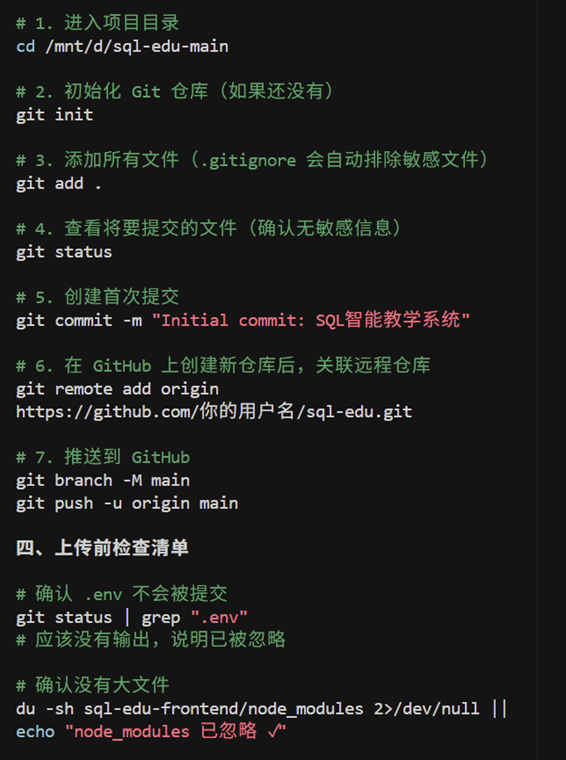

**Next : AI 教学算法的优化**，让这个系统变得更聪明、更懂学生。